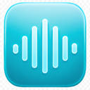

<p align="center">
  
</p>

# NoPop

Pop or crackling sounds coming from your Mac speakers in certain programs? Try this! NoPop quietly keeps the audio stream active with an extremely faint signal to help prevent idle-related audio clicks.

**macOS 13+ · SwiftUI · No dependencies · No network access**

## Features

- Clear **Turn On** and **Turn Off** controls in the menu bar.
- Live **Speakers awake** or **Inactive** status.
- Three signal levels: **−102**, **−96** and **−90 dBFS peak**.
- Optional startup at login using macOS Login Items.
- Automatic pause on battery power and during system sleep.
- Follows and displays the default audio output.
- Remembers your settings between launches.

NoPop starts inactive on first launch. Battery pause is enabled by default.

## Build and run

1. Open `NoPop.xcodeproj` in Xcode 15 or later.
2. Choose the **NoPop** scheme and **My Mac**.
3. Press **Command-R**.
4. Open the speaker icon in the menu bar and click **Turn On**.

NoPop has no Dock icon. Use **Quit NoPop** in its menu to exit.

For a Release build:

```sh
xcodebuild -project NoPop.xcodeproj -scheme NoPop \
  -configuration Release -destination 'generic/platform=macOS' \
  -derivedDataPath build build
```

The app is at `build/Build/Products/Release/NoPop.app`. The project uses local ad-hoc signing, so a development team is not required to build locally. Public binary distribution requires your own signing and notarization setup.

Move the app to Applications before enabling **Launch at login**. If approval is required, NoPop provides a button to open Login Items in System Settings.

## How it works

AVAudioEngine plays a repeating buffer of faint noise through AVAudioSourceNode. Opposite sample pairs remove DC and reduce low-frequency energy. There is no infrasonic tone.

Each source sample is clamped to **−90 dBFS peak** or lower, even if a stored setting is invalid. The default level is −90 dBFS peak, approximately −94.8 dBFS RMS. NoPop never changes system volume or adds a gain effect.

The source buffer occupies about 128 KiB. The audio callback does not allocate memory, acquire locks, generate random numbers or access files. Power, sleep and output notifications drive state changes without polling. Unchanged playback conditions preserve the running audio stream.

“Speakers awake” means that the audio engine is running. Whether the stream prevents hardware sleep depends on the audio device and driver. NoPop can help with idle-related clicks, but other causes of audio popping need separate fixes. External amplification or downstream processing can affect audibility. NoPop does not prevent the Mac itself from sleeping.

## Privacy

NoPop has no advertising, analytics, accounts or internet connection. Its sandbox grants no network, microphone or file-access entitlements.

Only the enabled state, battery-pause preference and numeric signal level are saved. Audio-output names are displayed in memory and are never written by the app. Login-item registration is managed by macOS. The app does not write diagnostic logs.

## Tests

Run **Product → Test**, or:

```sh
xcodebuild -project NoPop.xcodeproj -scheme NoPop \
  -destination 'platform=macOS' -derivedDataPath build test
```

The tests cover signal bounds, invalid settings, zero DC, signal energy, buffer wraparound, offline stereo rendering, all power-policy combinations, uninterrupted playback after irrelevant notifications, output changes, battery pause and cancellation of pending startup.

Tests require macOS 14 or later with the current Xcode test runtime. The app supports macOS 13 or later. Debug tests and universal Release builds are verified locally; audible results, physical device changes and actual login startup should be checked on the target Mac.

## Project structure

| File | Responsibility |
| --- | --- |
| `NoPopApp.swift` | Menu bar entry point |
| `MenuView.swift` | Controls and status |
| `AppModel.swift` | Preferences, playback policy and login registration |
| `KeepAliveAudio.swift` | Audio graph and render callback |
| `NoiseSignal.swift` | Bounded noise generation |
| `SystemMonitor.swift` | Power, output and sleep notifications |
| `NoPopTests.swift` | Signal, audio graph and playback lifecycle tests |
